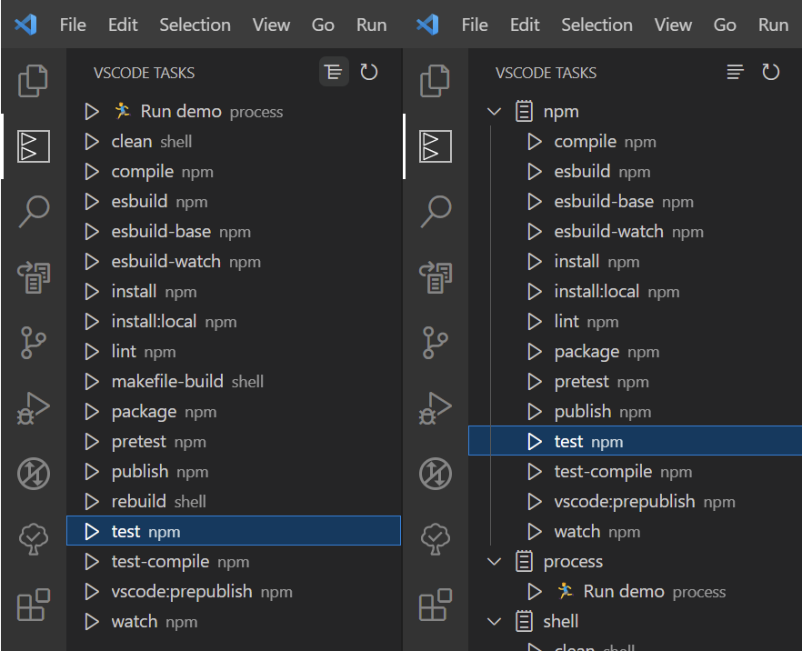

# VSCode tasks in sidebar

Automatically find all tasks recognized by VSCode and make them available in UI.

## Features

- Automatically find all tasks recognized by VSCode (inclusive from .vscode/tasks.json and package.json files)
- The tasks can be started directly from Visual Studio Code interface

## Usage

This extension has its own panel.

Open the panel and the extension will start the scan for the tasks.
If you made changes to the tasks.json, the extension will not detect these to avoid unnecessary scans.
You can force a rescan using the reload button found at top right of the panel.

If there are no tasks.json or tasks in the tasks.json, the panel will display this information.

The task will be started using the function provided by the Visual Studio Code API for starting tasks.

### Screenshot

Bellow you can see an example of found tasks as are they displayed by this extension:

## Requirements

There are no special requirements.

## Extension Settings

- vscodeTasksSidebar.defaultGrouped:

  - VSCode Tasks in Sidebar: initially shows all results grouped (otherwise as list)
  - default false

## Known Issues

None.

## Change Log

See Change Log [here](CHANGELOG.md)

## Issues

Submit an [issue](https://github.com/iulian-radu-at/vscode-tasks-sidebar/issues) if you find any bug or have any request.

## Contribution

Fork the [repo](https://github.com/iulian-radu-at/vscode-tasks-sidebar) and submit pull requests.
